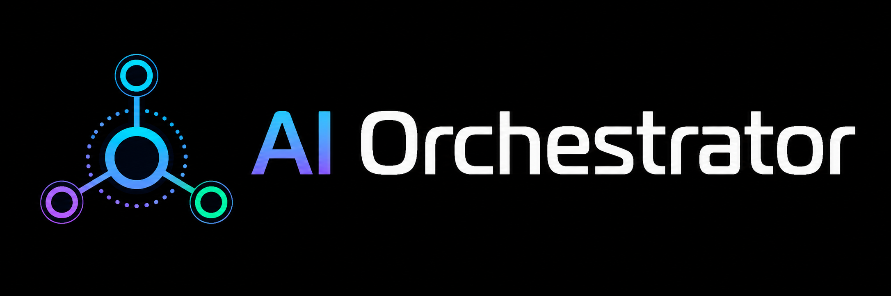

<div align="center">



<br><br>

**Orquestador local de agentes IA**  
Rutea tareas entre Claude, OpenAI y DeepSeek según el contexto del proyecto,  
con dashboard en vivo, tracking de costo y memoria RAG.

<br>


</div>

---

## Quick Start

**PowerShell**
```powershell
# 1. Crear entorno virtual
cd C:\ruta\ai-orchestrator
python -m venv .venv
.venv\Scripts\activate

# 2. Instalar dependencias
pip install -r requirements.txt
pip install -e .

# 3. Crear directorio de configuración y copiar plantillas
New-Item -ItemType Directory -Force "$env:USERPROFILE\.ai-orchestrator"
Copy-Item config.example.yaml "$env:USERPROFILE\.ai-orchestrator\config.yaml"
Copy-Item index.example.yaml  "$env:USERPROFILE\.ai-orchestrator\index.yaml"

# 4. Completar las API keys
notepad "$env:USERPROFILE\.ai-orchestrator\config.yaml"
```

**Git Bash**
```bash
# 1. Crear entorno virtual
cd /c/ruta/ai-orchestrator
python -m venv .venv
source .venv/Scripts/activate

# 2. Instalar dependencias
pip install -r requirements.txt
pip install -e .

# 3. Crear directorio de configuración y copiar plantillas
mkdir -p ~/.ai-orchestrator
cp config.example.yaml ~/.ai-orchestrator/config.yaml
cp index.example.yaml  ~/.ai-orchestrator/index.yaml

# 4. Completar las API keys
notepad ~/.ai-orchestrator/config.yaml
```

> **API Keys** — obtené cada key en su plataforma y pegala en `config.yaml`:
> | Proveedor | Plataforma | Obligatorio |
> |---|---|---|
> | Claude (Anthropic) | https://console.anthropic.com → API Keys | Sí (proveedor destino) |
> | DeepSeek | https://platform.deepseek.com → API Keys | Sí (router) |
> | OpenAI | https://platform.openai.com → API keys | Opcional |
>
> El mínimo funcional es **DeepSeek** (router) + **Claude** (proveedor destino). Ver guía detallada en [`docs/api-keys.md`](docs/api-keys.md).

```bash
# 5. Verificar instalación
ai-orchestrator --help

# 6. Registrar tu primer proyecto y levantar el dashboard
ai-orchestrator add mi-proyecto --path "C:\ruta\al\proyecto"
ai-orchestrator serve                  # abre http://127.0.0.1:8080
```

---

## Alcances

| Capacidad | Descripción |
|---|---|
| **Ruteo inteligente** | DeepSeek Flash analiza la tarea y el `context.yaml` del proyecto para decidir qué modelo usar — sin hardcodear |
| **Control de costos** | Tokens de entrada, salida y cache por run. Costo en USD calculado con tabla de precios configurable |
| **Memoria RAG** | ChromaDB indexa docs y respuestas previas por proyecto. Cada tarea recupera contexto semántico relevante (threshold L2=0.9 ≈ cosine_sim≥0.60) antes de llamar al modelo. Re-indexación idempotente: upsert por ID determinístico |
| **Dashboard en vivo** | Panel web con SSE — las filas aparecen en tiempo real sin recargar. Gauge de presupuesto, filtros y panel de detalle |
| **Inspector DB** | Vista interna de ChromaDB (colecciones + breakdown por proyecto) y SQLite (counts + últimos registros) |
| **Contextos y pasos** | Flujos estructurados multi-paso con checkpoints de alineación y registro de tool calls |
| **Barra de actividad** | Spans en tiempo real: Router → RAG → API → Index. Duración de cada operación visible mientras corre |
| **Sync Claude Code** | Importa sesiones de `~/.claude/projects/` al historial. Ejecutable vía hook `Stop` automáticamente |
| **Sync Codex** | Importa sesiones de OpenAI Codex CLI (`~/.codex/state_N.sqlite`) al historial, incluyendo tokens, costo y respuesta completa |
| **Doctor / Fix** | `doctor` diagnostica el estado completo en 4 secciones (config, MCP Claude/Codex, proyectos, DB). `fix` aplica correcciones automáticas: crea `.mcp.json`, `.codex/config.toml`, `context.yaml`, registra MCP global, sincroniza e indexa |
| **Menú de acciones** | Botones `doctor`, `fix`, `sync`, `index` en la barra de actividad del dashboard. Ejecutan las mismas acciones que la CLI y trazan resultados en tiempo real en el log de actividad |

**Fuera del alcance:** no es un proxy de API (el proceso corre localmente), no orquesta agentes en paralelo, no mantiene historial de conversación entre runs.

---

## Diseño

### Arquitectura

```
CLI / HTTP Server       cli.py · Typer + BaseHTTPRequestHandler
    │
    ├── Router          router.py
    │       Analiza tarea + context.yaml + keyword_hints
    │       Llama a DeepSeek Flash para decidir provider
    │       Enforce de step.provider si hay contexto activo
    │
    ├── RAG             rag.py · ChromaDB / FTS5 fallback
    │       retrieve_docs()      — chunks de docs del proyecto
    │       retrieve_responses() — respuestas previas similares
    │
    ├── Providers       providers/
    │       claude.py   → Anthropic API
    │       openai.py   → OpenAI API
    │       deepseek.py → DeepSeek API
    │
    ├── DB              db.py · SQLite WAL
    │       runs, contexts, steps, chunks, alignments, tool_calls
    │
    ├── SSE Bus         sse.py
    │       Eventos: run_started · run_done · run_failed · trace · budget_warning
    │
    └── Dashboard       dashboard.py · HTML server-side + JS vanilla
```

### Flujo de una tarea

```
Dashboard / CLI  →  submit_run()  →  Router  →  RAG retrieval
                                                      ↓
                Dashboard ←  SSE  ←  DB update  ←  Provider API  →  Index response
```

### Directorios

```
C:\ruta\ai-orchestrator\          ← repo
├── orchestrator\
│   ├── cli.py              ← servidor HTTP + comandos Typer
│   ├── router.py           ← decisión de proveedor
│   ├── db.py               ← SQLite WAL + migraciones
│   ├── rag.py              ← ChromaDB / FTS5 fallback
│   ├── tracer.py           ← spans al SSE bus
│   ├── background.py       ← worker threads
│   ├── dashboard.py        ← HTML del panel web
│   ├── sse.py              ← Server-Sent Events
│   ├── codex_watcher.py    ← importador de sesiones Codex CLI
│   └── providers\          ← claude · openai · deepseek
└── docs\
    ├── index.html      ← documentación completa en /docs
    └── img\            ← banner, logo, favicons

~\.ai-orchestrator\                  ← runtime (no versionado)
├── config.yaml                      ← API keys, modelos, pricing
├── index.yaml                       ← alias → path de cada proyecto
├── runs.db                          ← historial SQLite
└── chroma\                          ← índice vectorial

mi-proyecto\                         ← versionado en cada repo
└── .orchestrator\
    └── context.yaml                 ← stack, convenciones, reglas de ruteo
```

### Base de datos SQLite

| Tabla | Contenido |
|---|---|
| `runs` | Cada llamada a un proveedor. Tokens, costo USD, duración, respuesta completa |
| `contexts` | Flujos de trabajo multi-paso (título, descripción, estado) |
| `steps` | Pasos de un contexto. Provider sugerido, orden, estado |
| `chunks` | Archivos indexados por RAG (proyecto, path, cantidad de chunks) |
| `alignments` | Checkpoints de alineación confirmados por el agente |
| `tool_calls` | Herramientas invocadas durante un paso (nombre, input, output, duración) |

---

## Herramientas

### Gestión de proyectos

```powershell
ai-orchestrator add mi-proyecto --path "C:\ruta\al\proyecto"
ai-orchestrator list
ai-orchestrator remove mi-proyecto
ai-orchestrator rename mi-proyecto nuevo-alias   # renombra alias en índice e historial
```

### Ejecutar tareas

```powershell
# El router decide el proveedor automáticamente
ai-orchestrator run --project mi-proyecto --task "revisar el endpoint de login"

# Forzar proveedor
ai-orchestrator run --project mi-proyecto --task "..." --model claude

# Modo investigación (Claude Opus)
ai-orchestrator run --project mi-proyecto --task "..." --research
```

### Dashboard web

```powershell
ai-orchestrator serve                          # http://127.0.0.1:8080
ai-orchestrator serve --port 9090 --no-open
```

El dashboard tiene dos pestañas:

- **Dashboard** — tabla de runs en tiempo real, formulario de nueva tarea, panel de detalle, gauge de presupuesto, barra de actividad con spans
- **Inspector** — estado interno de ChromaDB y SQLite, registro de proyectos con folder picker nativo

> **Tipo de cambio USD/CLP (opcional):** El dashboard incluye un panel para consultar el tipo de cambio vía la API del Banco Central de Chile (`si3.bcentral.cl`). Es una feature opcional y específica de Chile — requiere credenciales gratuitas en ese sitio. Usuarios fuera de Chile pueden ignorarla; el resto del dashboard funciona sin configurarla.

La documentación completa está en **`http://127.0.0.1:8080/docs`** una vez levantado el servidor.

### Indexación RAG

```powershell
ai-orchestrator index-docs mi-proyecto
ai-orchestrator index-docs mi-proyecto --exclude "vendor,storage,public/build"  # excluir carpetas
ai-orchestrator index-docs mi-proyecto --exclude "vendor" --save                 # guardar exclusiones en context.yaml
```

> Sin costo de IA — usa embeddings locales (`all-MiniLM-L6-v2`). También disponible desde el Inspector del dashboard.
> Re-indexar es siempre seguro: el upsert usa IDs determinísticos (`proyecto::ruta::chunk_idx`), no acumula duplicados.

**Parámetros RAG configurables en `rag.py`:**

| Parámetro | Valor | Descripción |
|---|---|---|
| `_CHUNK_SIZE` | 1500 | Caracteres por chunk |
| `_CHUNK_OVERLAP` | 200 | Solapamiento entre chunks |
| `_DISTANCE_THRESHOLD` | 0.9 | Umbral L2 (≈ cosine_sim≥0.60). Bajar = más permisivo |
| `_MAX_FILE_BYTES` | 100 000 | Tamaño máximo de archivo a indexar |
| `_MAX_PY_FILES` | 30 | Máximo de archivos `.py` por proyecto |

Extensiones indexadas: `.md` `.txt` `.yaml` `.yml` `.toml` `.rst` `.json` (docs) + `.py` (código, hasta 30 archivos).

Directorios siempre excluidos: `.venv` `venv` `__pycache__` `.git` `node_modules` `vendor` `build` `dist` `.claude` `.codex` `.aws` `.ssh`.

Exclusión automática por stack (detectada desde `context.yaml`):

| Stack | Carpetas sugeridas |
|---|---|
| `laravel` / `php` | `vendor` `storage` `bootstrap` |
| `node` / `react` | `node_modules` `dist` `.next` `build` |
| `python` | `.venv` `venv` `__pycache__` `dist` `build` |
| `go` | `vendor` |
| `ruby` | `vendor` `tmp` `log` |

### Historial

```powershell
ai-orchestrator history
ai-orchestrator history --project mi-proyecto --last 50
```

### Contextos y pasos

```powershell
ai-orchestrator create-context mi-proyecto "Implementar autenticación JWT"
ai-orchestrator list-contexts mi-proyecto
```

### Diagnóstico y correcciones automáticas

```powershell
# Verificar el estado completo del orquestador
ai-orchestrator doctor
ai-orchestrator doctor --verbose         # muestra paths, modelos y chunk counts
ai-orchestrator doctor -p mi-proyecto   # limitar a un proyecto específico

# Aplicar correcciones automáticas
ai-orchestrator fix                      # crea .mcp.json + .codex/config.toml + context.yaml faltantes
ai-orchestrator fix --global-mcp        # + registra MCP en ~/.claude/settings.json global
ai-orchestrator fix --sync              # + importa sesiones Claude Code y commits Git
ai-orchestrator fix --index             # + indexa proyectos sin chunks en ChromaDB
ai-orchestrator fix --all               # aplica todas las mejoras anteriores juntas
```

`doctor` verifica cuatro secciones y muestra ✓ / ⚠ / ✗ por cada ítem:

| Sección | Qué revisa |
|---|---|
| **Entorno** | Python version, `.venv` activo |
| **Configuración global** | `config.yaml` cargable, API keys de los 3 providers, `index.yaml`, `runs.db`, ChromaDB |
| **MCP / Claude Code / Codex** | `.mcp.json` en el proyecto, `.codex/config.toml`, MCP en `~/.claude/settings.json` global |
| **Proyectos** | Ruta existe, `context.yaml` generado, indexado en ChromaDB |

`fix` aplica mejoras en orden determinista: `.mcp.json` → `.codex/config.toml` → `context.yaml` → MCP global → sync → index. Salta automáticamente lo que ya está en orden y reporta cada acción tomada.

> **Dashboard:** `doctor`, `fix`, `sync` e `index` también están disponibles como botones en la **barra de actividad** (franja inferior del dashboard). Los resultados se muestran en tiempo real en el log de actividad sin recargar la página.

### Importar trabajo de agentes externos

```powershell
# Registrar en el historial una sesión realizada por otro agente
ai-orchestrator import-context mi-proyecto \
  --task "revisar performance de queries" \
  --response "Se detectaron 3 queries N+1 en el listado de usuarios..." \
  --agent deepseek --model deepseek-v4-flash

# Limpiar runs importados de un proyecto/proveedor
ai-orchestrator clear-imports mi-proyecto
ai-orchestrator clear-imports mi-proyecto --provider deepseek
```

---

### Sync de sesiones Claude Code y Codex

```powershell
# Importar sesiones de Claude Code (~/.claude/projects/)
ai-orchestrator sync-cc           # importa sesiones nuevas
ai-orchestrator sync-cc --quiet   # para hooks

# Importar sesiones de OpenAI Codex CLI (~/.codex/state_N.sqlite)
ai-orchestrator sync-codex
ai-orchestrator sync-codex --quiet
```

**Integración automática con Claude Code** — agregar en `~/.claude/settings.json`:

```json
{
  "hooks": {
    "Stop": [{
      "matcher": "",
      "hooks": [{
        "type": "command",
        "command": "C:\\Fuentes\\ai-orchestrator\\.venv\\Scripts\\ai-orchestrator.exe sync-cc --quiet"
      }]
    }]
  }
}
```

---

## Configuración

### `~/.ai-orchestrator/config.yaml`

```yaml
providers:
  claude:
    api_key: "sk-ant-..."
    model: "claude-sonnet-4-6"
  openai:
    api_key: "sk-..."
    model: "gpt-4o"
  deepseek:
    api_key: "sk-..."
    model: "deepseek-v4-flash"

router:
  provider: "deepseek"
  fallback_provider: "claude"

defaults:
  default_provider: "claude"

pricing:
  claude-sonnet-4-6:
    input: 3.00
    output: 15.00
    cache_write: 3.75
    cache_read: 0.30
  deepseek-v4-flash:
    input: 0.14
    output: 0.28

budgets:
  default_daily_budget_usd: 5.00
  warning_threshold: 0.80
```

> `config.yaml` vive en `~/.ai-orchestrator/` y **nunca se versiona**. Ver [`config.example.yaml`](config.example.yaml) para la plantilla completa y [`docs/api-keys.md`](docs/api-keys.md) para obtener cada API key.

### `.orchestrator/context.yaml` (por proyecto)

```yaml
name: mi-proyecto
stack: PHP/Laravel
description: Aplicación web con autenticación y roles

# Límite de gasto diario en USD para este proyecto (sobreescribe el default de config.yaml)
daily_budget_usd: 2.00

conventions:
  - Form Requests para validación
  - PSR-12

preferred_models:
  default: claude
  notes: >
    Autenticación y permisos van a Claude.
    Tests y seeders pueden ir a DeepSeek.
    Refactors frontend van bien con OpenAI.

# Palabras clave que influyen en la decisión del router (weight 1-5)
keyword_hints:
  - { match: "seguridad", provider: claude,   weight: 3 }
  - { match: "test",      provider: deepseek, weight: 2 }
  - { match: "refactor",  provider: openai,   weight: 1 }
```

Ver esquema completo en [`docs/context-schema.md`](docs/context-schema.md).

---

## Modelos disponibles

| Proveedor | Modelo | Input/1M | Output/1M | Uso recomendado |
|---|---|---|---|---|
| `claude` | `claude-sonnet-4-6` | $3,00 | $15,00 | Tareas generales — modelo por defecto |
| `claude` | `claude-opus-4-8` | $15,00 | $75,00 | Investigación profunda (`--research`) |
| `claude` | `claude-haiku-4-5-20251001` | $0,80 | $4,00 | Tareas simples y económicas |
| `openai` | `gpt-4o` | $5,00 | $15,00 | Alternativa a Claude |
| `openai` | `gpt-4o-mini` | $0,15 | $0,60 | Tareas económicas con OpenAI |
| `deepseek` | `deepseek-chat` | $0,14 | $0,28 | Router / borradores / tareas masivas |
| `deepseek` | `deepseek-v4-flash` | $0,14 | $0,28 | Modelo default del router |

> Precios en USD por millón de tokens. Los modelos Claude soportan cache write/read (ver `pricing` en `config.yaml`).

---

## Troubleshooting

| Problema | Causa | Solución |
|---|---|---|
| `ProjectNotFoundError: alias 'X' no está registrado` | El alias no existe en el índice | `ai-orchestrator add X --path "C:\ruta"` |
| `ChromaDB no inicializa` | Permisos o directorio faltante | Verificar escritura en `~/.ai-orchestrator/chroma/` |
| `API key inválida` | Key incorrecta o expirada | Revisar `config.yaml`, regenerar key en la plataforma |
| `ModuleNotFoundError: chromadb` | ChromaDB no instalado | `pip install chromadb` — sin él el RAG usa FTS5 como fallback |
| Mojibake en contextos MCP desde Codex (Windows) | `sys.stdin` hereda encoding `cp1252` | Ya resuelto: el servidor fuerza `utf-8` al arrancar. Datos previos: reparar con `update_context` / `update_step` |
| Panel de actividad se abre solo | Comportamiento esperado en la primera traza | Colapsarlo manualmente — el estado se respeta para el resto de la sesión |
| `doctor` muestra ✗ en ChromaDB | ChromaDB no inicializa o colección vacía | Ejecutar `ai-orchestrator index-docs <alias>` por proyecto |

---

## Instalación

Ver la guía paso a paso en [Quick Start](#quick-start) al inicio de este documento.

`requirements.txt` ya incluye ChromaDB. Sin él el router usa FTS5 (SQLite full-text search) como fallback automático; con él la búsqueda semántica está disponible.

**VS Code:** `Ctrl+Shift+P` → Tasks: Run Task → **Orchestrator: Dashboard**

---

<div align="center">
MIT License
</div>
