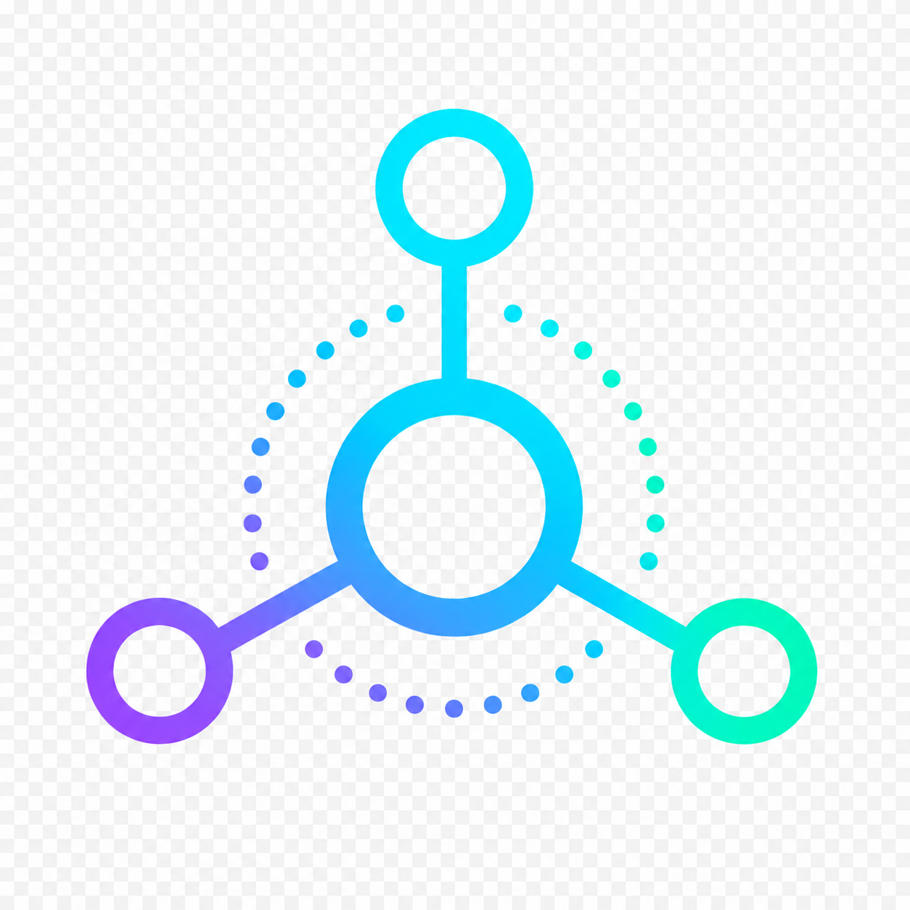

<div align="center">


<br>



<br><br>

**Orquestador local de agentes IA**  
Rutea tareas entre Claude, OpenAI y DeepSeek según el contexto del proyecto,  
con dashboard en vivo, tracking de costo y memoria RAG.

<br>


</div>

---

## Alcances

| Capacidad | Descripción |
|---|---|
| **Ruteo inteligente** | DeepSeek Flash analiza la tarea y el `context.yaml` del proyecto para decidir qué modelo usar — sin hardcodear |
| **Control de costos** | Tokens de entrada, salida y cache por run. Costo en USD calculado con tabla de precios configurable |
| **Memoria RAG** | ChromaDB indexa docs y respuestas previas por proyecto. Cada tarea recupera contexto semántico relevante antes de llamar al modelo |
| **Dashboard en vivo** | Panel web con SSE — las filas aparecen en tiempo real sin recargar. Gauge de presupuesto, filtros y panel de detalle |
| **Inspector DB** | Vista interna de ChromaDB (colecciones + breakdown por proyecto) y SQLite (counts + últimos registros) |
| **Contextos y pasos** | Flujos estructurados multi-paso con checkpoints de alineación y registro de tool calls |
| **Barra de actividad** | Spans en tiempo real: Router → RAG → API → Index. Duración de cada operación visible mientras corre |
| **Sync Claude Code** | Importa sesiones de `~/.claude/projects/` al historial. Ejecutable vía hook `Stop` automáticamente |

**Fuera del alcance:** no es un proxy de API (el proceso corre localmente), no orquesta agentes en paralelo, no mantiene historial de conversación entre runs.

---

## Diseño

### Arquitectura

```
CLI / HTTP Server       cli.py · Typer + BaseHTTPRequestHandler
    │
    ├── Router          router.py
    │       Analiza tarea + context.yaml + keyword_hints
    │       Llama a DeepSeek Flash para decidir provider
    │       Enforce de step.provider si hay contexto activo
    │
    ├── RAG             rag.py · ChromaDB / FTS5 fallback
    │       retrieve_docs()      — chunks de docs del proyecto
    │       retrieve_responses() — respuestas previas similares
    │
    ├── Providers       providers/
    │       claude.py   → Anthropic API
    │       openai.py   → OpenAI API
    │       deepseek.py → DeepSeek API
    │
    ├── DB              db.py · SQLite WAL
    │       runs, contexts, steps, chunks, alignments, tool_calls
    │
    ├── SSE Bus         sse.py
    │       Eventos: run_started · run_done · run_failed · trace · budget_warning
    │
    └── Dashboard       dashboard.py · HTML server-side + JS vanilla
```

### Flujo de una tarea

```
Dashboard / CLI  →  submit_run()  →  Router  →  RAG retrieval
                                                      ↓
                Dashboard ←  SSE  ←  DB update  ←  Provider API  →  Index response
```

### Directorios

```
C:\Fuentes\ai-orchestrator\          ← repo
├── orchestrator\
│   ├── cli.py          ← servidor HTTP + comandos Typer
│   ├── router.py       ← decisión de proveedor
│   ├── db.py           ← SQLite WAL + migraciones
│   ├── rag.py          ← ChromaDB / FTS5 fallback
│   ├── tracer.py       ← spans al SSE bus
│   ├── background.py   ← worker threads
│   ├── dashboard.py    ← HTML del panel web
│   ├── sse.py          ← Server-Sent Events
│   └── providers\      ← claude · openai · deepseek
└── docs\
    ├── index.html      ← documentación completa en /docs
    └── img\            ← banner, logo, favicons

~\.ai-orchestrator\                  ← runtime (no versionado)
├── config.yaml                      ← API keys, modelos, pricing
├── index.yaml                       ← alias → path de cada proyecto
├── runs.db                          ← historial SQLite
└── chroma\                          ← índice vectorial

mi-proyecto\                         ← versionado en cada repo
└── .orchestrator\
    └── context.yaml                 ← stack, convenciones, reglas de ruteo
```

### Base de datos SQLite

| Tabla | Contenido |
|---|---|
| `runs` | Cada llamada a un proveedor. Tokens, costo USD, duración, respuesta completa |
| `contexts` | Flujos de trabajo multi-paso (título, descripción, estado) |
| `steps` | Pasos de un contexto. Provider sugerido, orden, estado |
| `chunks` | Archivos indexados por RAG (proyecto, path, cantidad de chunks) |
| `alignments` | Checkpoints de alineación confirmados por el agente |
| `tool_calls` | Herramientas invocadas durante un paso (nombre, input, output, duración) |

---

## Herramientas

### Gestión de proyectos

```powershell
ai-orchestrator add mi-proyecto --path "C:\ruta\al\proyecto"
ai-orchestrator list
ai-orchestrator remove mi-proyecto
```

### Ejecutar tareas

```powershell
# El router decide el proveedor automáticamente
ai-orchestrator run --project mi-proyecto --task "revisar el endpoint de login"

# Forzar proveedor
ai-orchestrator run --project mi-proyecto --task "..." --model claude

# Modo investigación (Claude Opus)
ai-orchestrator run --project mi-proyecto --task "..." --research
```

### Dashboard web

```powershell
ai-orchestrator serve                          # http://127.0.0.1:8080
ai-orchestrator serve --port 9090 --no-open
```

El dashboard tiene dos pestañas:

- **Dashboard** — tabla de runs en tiempo real, formulario de nueva tarea, panel de detalle, gauge de presupuesto, barra de actividad con spans
- **Inspector** — estado interno de ChromaDB y SQLite, registro de proyectos con folder picker nativo

La documentación completa está en **`http://127.0.0.1:8080/docs`** una vez levantado el servidor.

### Indexación RAG

```powershell
ai-orchestrator index-docs mi-proyecto
```

> Sin costo de IA — usa embeddings locales (`all-MiniLM-L6-v2`). También disponible desde el Inspector del dashboard.

### Historial

```powershell
ai-orchestrator history
ai-orchestrator history --project mi-proyecto --last 50
```

### Contextos y pasos

```powershell
ai-orchestrator create-context mi-proyecto "Implementar autenticación JWT"
ai-orchestrator list-contexts mi-proyecto
```

### Sync de sesiones Claude Code

```powershell
ai-orchestrator sync-cc           # importa sesiones nuevas
ai-orchestrator sync-cc --quiet   # para hooks
```

**Integración automática** — agregar en `~/.claude/settings.json`:

```json
{
  "hooks": {
    "Stop": [{
      "matcher": "",
      "hooks": [{
        "type": "command",
        "command": "C:\\Fuentes\\ai-orchestrator\\.venv\\Scripts\\ai-orchestrator.exe sync-cc --quiet"
      }]
    }]
  }
}
```

---

## Configuración

### `~/.ai-orchestrator/config.yaml`

```yaml
providers:
  claude:
    api_key: "sk-ant-..."
    model: "claude-sonnet-4-6"
  openai:
    api_key: "sk-..."
    model: "gpt-4o"
  deepseek:
    api_key: "sk-..."
    model: "deepseek-v4-flash"

router:
  provider: "deepseek"
  fallback_provider: "claude"

defaults:
  default_provider: "claude"

pricing:
  claude-sonnet-4-6:
    input: 3.00
    output: 15.00
    cache_write: 3.75
    cache_read: 0.30
  deepseek-v4-flash:
    input: 0.14
    output: 0.28

budgets:
  default_daily_budget_usd: 5.00
  warning_threshold: 0.80
```

> `config.yaml` vive en `~/.ai-orchestrator/` y **nunca se versiona**. Ver [`config.example.yaml`](config.example.yaml) para la plantilla completa y [`docs/api-keys.md`](docs/api-keys.md) para obtener cada API key.

### `.orchestrator/context.yaml` (por proyecto)

```yaml
name: mi-proyecto
stack: PHP/Laravel
description: Aplicación web con autenticación y roles

conventions:
  - Form Requests para validación
  - PSR-12

preferred_models:
  default: claude
  notes: >
    Autenticación y permisos van a Claude.
    Tests y seeders pueden ir a DeepSeek.
    Refactors frontend van bien con OpenAI.

keyword_hints:
  - { match: "seguridad", provider: claude,   weight: 3 }
  - { match: "test",      provider: deepseek, weight: 2 }
  - { match: "refactor",  provider: openai,   weight: 1 }
```

Ver esquema completo en [`docs/context-schema.md`](docs/context-schema.md).

---

## Instalación

```powershell
cd C:\Fuentes\ai-orchestrator
python -m venv .venv
.venv\Scripts\activate
pip install -r requirements.txt
pip install -e .

# Configuración inicial
cp config.example.yaml $env:USERPROFILE\.ai-orchestrator\config.yaml
```

**Búsqueda vectorial** (opcional, recomendada):

```powershell
pip install chromadb
```

Sin ChromaDB el router usa FTS5 (SQLite full-text search) como fallback automático.

**VS Code:** `Ctrl+Shift+P` → Tasks: Run Task → **Orchestrator: Dashboard**

---

<div align="center">
MIT License
</div>
