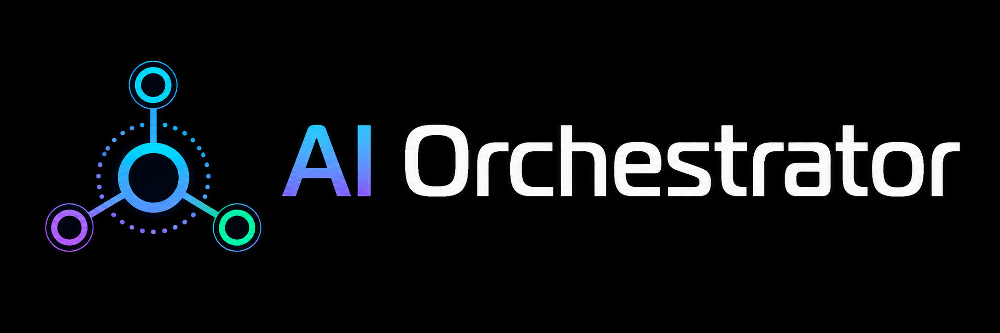

<div align="center">



<br><br>

**Memoria, trazabilidad y control de costos para desarrollo asistido por agentes IA**  
Rutea tareas entre Claude, OpenAI, DeepSeek y Gemini según el contexto del proyecto,  
con dashboard en vivo, tracking de costo y memoria RAG.

<br>


**[github.com/csantisdev/ai-orchestrator](https://github.com/csantisdev/ai-orchestrator)**

</div>

---

## Por qué

Los agentes IA (Claude Code, Codex, DeepSeek) generan valor en tareas acotadas, pero el historial queda disperso en archivos de sesión separados, sin visibilidad de costos ni contexto acumulado entre conversaciones. Sin memoria estructurada, cada sesión empieza desde cero y el gasto es opaco.

ai-orchestrator centraliza ese historial localmente: indexa respuestas previas en ChromaDB, rutea cada tarea al modelo más eficiente según el contexto del proyecto, y registra tokens y costo USD de cada run en SQLite. El dashboard SSE muestra el estado en tiempo real. El servidor MCP expone 18 herramientas para que cualquier agente pueda leer y escribir en el historial sin salir de su entorno de trabajo.

---

## Empezá por acá

Si es tu primera vez con el proyecto, no necesitás entender MCP, RAG ni la arquitectura interna para obtener valor.

**Objetivo del primer uso:** instalar, configurar dos API keys, registrar un proyecto y ejecutar una tarea o abrir el dashboard.

### Qué necesitás antes de empezar

- **Python 3.10 o superior**
- Un repo local donde quieras trabajar
- **2 API keys para el camino mínimo recomendado**
  - **DeepSeek** → decide el ruteo inicial
  - **Claude (Anthropic)** → resuelve las tareas

> También podés configurar OpenAI o Gemini más adelante. Para arrancar, no hacen falta.

### Primeros 5 minutos

**PowerShell**
```powershell
# 1. Entrar al repo y crear entorno virtual
cd C:\ruta\ai-orchestrator
python -m venv .venv
.venv\Scripts\activate

# 2. Instalar dependencias
pip install -r requirements.txt
pip install -e .

# 3. Crear configuración local
New-Item -ItemType Directory -Force "$env:USERPROFILE\.ai-orchestrator"
Copy-Item config.example.yaml "$env:USERPROFILE\.ai-orchestrator\config.yaml"
Copy-Item index.example.yaml  "$env:USERPROFILE\.ai-orchestrator\index.yaml"

# 4. Completar API keys
notepad "$env:USERPROFILE\.ai-orchestrator\config.yaml"
```

**Git Bash**
```bash
# 1. Entrar al repo y crear entorno virtual
cd /c/ruta/ai-orchestrator
python -m venv .venv
source .venv/Scripts/activate

# 2. Instalar dependencias
pip install -r requirements.txt
pip install -e .

# 3. Crear configuración local
mkdir -p ~/.ai-orchestrator
cp config.example.yaml ~/.ai-orchestrator/config.yaml
cp index.example.yaml  ~/.ai-orchestrator/index.yaml

# 4. Completar API keys
notepad ~/.ai-orchestrator/config.yaml
```

> **Dónde obtener las API keys**
>
> | Proveedor | Plataforma | Obligatorio para empezar |
> |---|---|---|
> | Claude (Anthropic) | https://console.anthropic.com → API Keys | Sí |
> | DeepSeek | https://platform.deepseek.com → API Keys | Sí |
> | OpenAI | https://platform.openai.com → API keys | No |
> | Gemini (Google) | https://aistudio.google.com/apikey | No |
>
> Guía detallada: [`docs/api-keys.md`](docs/api-keys.md).

```bash
# 5. Verificar que la CLI quedó instalada
ai-orchestrator --help

# 6. Registrar tu primer proyecto
ai-orchestrator add mi-proyecto --path "C:\ruta\al\proyecto"

# 7. Levantar el dashboard
ai-orchestrator serve
```

### Qué deberías ver si salió bien

- `ai-orchestrator --help` muestra la lista de comandos disponibles.
- `ai-orchestrator add ...` registra el alias del proyecto sin error.
- `ai-orchestrator serve` abre el dashboard en `http://127.0.0.1:8080`.
- Desde el dashboard ya podés lanzar tareas y ver historial, costo y actividad.

### Primer flujo recomendado

Si no sabés por dónde empezar, usá este orden:

1. Configurá `config.yaml`
2. Registrá un proyecto con `ai-orchestrator add`
3. Abrí el dashboard con `ai-orchestrator serve`
4. Ejecutá una tarea simple
5. Más adelante explorá indexación RAG, presets, sync o MCP

---

## ¿Qué usar según tu objetivo?

| Quiero... | Empezá con... |
|---|---|
| Correr una tarea rápido | `ai-orchestrator run` o dashboard |
| Ver historial y costo | dashboard o `ai-orchestrator history` |
| Arreglar setup/configuración | `ai-orchestrator doctor` y `ai-orchestrator fix` |
| Indexar documentación del proyecto | `ai-orchestrator index-docs` |
| Conectar otro agente o IDE | MCP |
| Auditar modelos, pricing o router | comandos de evaluación y pricing |

> **Regla simple:** si sos nuevo, empezá por **CLI + dashboard**. MCP, presets, benchmarking y auditoría son capas avanzadas.

---

## Qué podés hacer con ai-orchestrator

| Capacidad | En qué te ayuda |
|---|---|
| **Ruteo inteligente** | Elige el modelo más conveniente según la tarea y el contexto del proyecto |
| **Control de costos** | Guarda tokens y costo estimado por run para que el gasto deje de ser una caja negra |
| **Dashboard en vivo** | Permite lanzar tareas y ver actividad, historial y presupuesto en tiempo real |
| **Memoria del proyecto** | Recupera documentación y respuestas previas para no empezar siempre desde cero |
| **Contextos y pasos** | Ordena trabajo multi-paso cuando una tarea es más grande |
| **Diagnóstico (`doctor`)** | Detecta problemas de entorno, configuración, MCP, tracking e indexación |
| **Correcciones (`fix`)** | Crea y completa archivos de configuración comunes |
| **Sync de sesiones** | Importa trabajo previo desde Claude Code, Codex y Git |
| **Agentes (presets)** | Reutiliza configuraciones de provider/model/system prompt para tareas repetidas |

**Fuera del alcance:** no es un proxy de API (el proceso corre localmente), no orquesta agentes en paralelo, no mantiene historial de conversación entre runs.

---

## MCP (opcional, avanzado)

MCP te sirve si querés que herramientas como **Claude Code, Codex, Cursor o Gemini Code Assist** usen el historial y el tracking de `ai-orchestrator` sin pasar por la CLI manualmente.

Si recién estás empezando, **podés ignorar esta sección** y usar solo CLI + dashboard.

### Cuándo vale la pena usar MCP

- Querés que un agente externo lea el contexto del proyecto
- Querés registrar pasos, alineamientos y tool calls desde otro cliente
- Querés unificar el historial entre agentes y sesiones

### Camino corto

- `ai-orchestrator doctor` revisa el estado de la integración
- `ai-orchestrator fix` crea la configuración básica
- `ai-orchestrator fix --global-mcp` agrega la configuración global para Claude

### Qué hace internamente

- Expone herramientas vía **STDIO local** (no abre puertos de red)
- Aplica perfiles y alcance por proyecto con variables `ORCHESTRATOR_MCP_*`
- Registra las invocaciones para trazabilidad

Para instalación, ejemplos de archivos y detalle completo de las 18 tools:

- documentación web: `http://127.0.0.1:8080/docs`
- archivo del repo: [`docs/mcp.html`](docs/mcp.html)

Si el MCP no está disponible, el tracking también puede operarse desde CLI con `step start`, `step done`, `step reset` y `step skip`.

---

## Referencia técnica

Desde este punto el README entra en modo más técnico: arquitectura, comandos avanzados, configuración detallada y operaciones de soporte.

## Diseño

### Arquitectura

```
CLI / HTTP Server       cli.py · Typer + BaseHTTPRequestHandler
    │
    ├── Router          router.py
    │       Analiza tarea + context.yaml + keyword_hints
    │       Llama a DeepSeek Flash para decidir provider
    │       Enforce de step.provider si hay contexto activo
    │
    ├── RAG             rag.py · ChromaDB / FTS5 fallback
    │       retrieve_docs()      — chunks de docs del proyecto
    │       retrieve_responses() — respuestas previas similares
    │
    ├── Providers       providers/
    │       claude.py   → Anthropic API
    │       openai.py   → OpenAI API
    │       deepseek.py → DeepSeek API
    │       gemini.py   → Google Generative Language API
    │
    ├── DB              db.py · SQLite WAL
    │       runs, contexts, steps, chunks, alignments, tool_calls
    │
    ├── SSE Bus         sse.py
    │       Eventos: run_started · run_done · run_failed · trace · budget_warning
    │
    └── Dashboard       dashboard.py · HTML server-side + JS vanilla
```

### Flujo de una tarea

```
Dashboard / CLI  →  submit_run()  →  Router  →  RAG retrieval
                                                      ↓
                Dashboard ←  SSE  ←  DB update  ←  Provider API  →  Index response
```

### Directorios

```
C:\ruta\ai-orchestrator\          ← repo
├── orchestrator\
│   ├── cli.py              ← servidor HTTP + comandos Typer
│   ├── router.py           ← decisión de proveedor
│   ├── db.py               ← SQLite WAL + migraciones
│   ├── rag.py              ← ChromaDB / FTS5 fallback
│   ├── tracer.py           ← spans al SSE bus
│   ├── background.py       ← worker threads
│   ├── dashboard.py        ← HTML del panel web
│   ├── sse.py              ← Server-Sent Events
│   ├── codex_watcher.py    ← importador de sesiones Codex CLI
│   └── providers\          ← claude · openai · deepseek · gemini
└── docs\
    ├── index.html      ← documentación completa en /docs
    └── img\            ← banner, logo, favicons

~\.ai-orchestrator\                  ← runtime (no versionado)
├── config.yaml                      ← API keys, modelos, pricing
├── index.yaml                       ← alias → path de cada proyecto
├── runs.db                          ← historial SQLite
└── chroma\                          ← índice vectorial

mi-proyecto\                         ← versionado en cada repo
└── .orchestrator\
    └── context.yaml                 ← stack, convenciones, reglas de ruteo
```

### Base de datos SQLite

| Tabla | Contenido |
|---|---|
| `runs` | Cada llamada a un proveedor. Tokens, costo USD, duración, respuesta completa |
| `contexts` | Flujos de trabajo multi-paso (título, descripción, estado) |
| `steps` | Pasos de un contexto. Provider sugerido, orden, estado |
| `chunks` | Archivos indexados por RAG (proyecto, path, cantidad de chunks) |
| `alignments` | Checkpoints de alineación confirmados por el agente |
| `tool_calls` | Herramientas invocadas durante un paso (nombre, input, output, duración) |

---

## Herramientas

### Gestión de proyectos

```powershell
ai-orchestrator add mi-proyecto --path "C:\ruta\al\proyecto"
ai-orchestrator list
ai-orchestrator remove mi-proyecto
ai-orchestrator rename mi-proyecto nuevo-alias   # renombra alias en índice e historial
```

### Ejecutar tareas

```powershell
# El router decide el proveedor automáticamente
ai-orchestrator run --project mi-proyecto --task "revisar el endpoint de login"

# Forzar proveedor
ai-orchestrator run --project mi-proyecto --task "..." --model claude

# Modo investigación (Claude Opus)
ai-orchestrator run --project mi-proyecto --task "..." --research
```

### Dashboard web

```powershell
ai-orchestrator serve                          # http://127.0.0.1:8080
ai-orchestrator serve --port 9090 --no-open
```

El dashboard tiene dos pestañas:

- **Dashboard** — tabla de runs en tiempo real, formulario de nueva tarea, panel de detalle, gauge de presupuesto, barra de actividad con spans
- **Inspector** — estado interno de ChromaDB y SQLite, registro de proyectos con folder picker nativo

> **Tipo de cambio USD/CLP (opcional):** El dashboard incluye un panel para consultar el tipo de cambio vía la API del Banco Central de Chile (`si3.bcentral.cl`). Es una feature opcional y específica de Chile — requiere credenciales gratuitas en ese sitio. Usuarios fuera de Chile pueden ignorarla; el resto del dashboard funciona sin configurarla.

La documentación completa está en **`http://127.0.0.1:8080/docs`** una vez levantado el servidor.

### Indexación RAG

```powershell
ai-orchestrator index-docs mi-proyecto
ai-orchestrator index-docs mi-proyecto --exclude "vendor,storage,public/build"  # excluir carpetas
ai-orchestrator index-docs mi-proyecto --exclude "vendor" --save                 # guardar exclusiones en context.yaml
```

> Sin costo de IA — usa embeddings locales (`all-MiniLM-L6-v2`). También disponible desde el Inspector del dashboard.
> Re-indexar es siempre seguro: el upsert usa IDs determinísticos (`proyecto::ruta::chunk_idx`), no acumula duplicados.

**Parámetros RAG configurables en `rag.py`:**

| Parámetro | Valor | Descripción |
|---|---|---|
| `_CHUNK_SIZE` | 1500 | Caracteres por chunk |
| `_CHUNK_OVERLAP` | 200 | Solapamiento entre chunks |
| `_DISTANCE_THRESHOLD` | 0.9 | Umbral L2 (≈ cosine_sim≥0.60). Bajar = más permisivo |
| `_MAX_FILE_BYTES` | 100 000 | Tamaño máximo de archivo a indexar |
| `_MAX_PY_FILES` | 30 | Máximo de archivos `.py` por proyecto |

Extensiones indexadas: `.md` `.txt` `.yaml` `.yml` `.toml` `.rst` `.json` (docs) + `.py` (código, hasta 30 archivos).

Directorios siempre excluidos: `.venv` `venv` `__pycache__` `.git` `node_modules` `vendor` `build` `dist` `.claude` `.codex` `.aws` `.ssh`.

Exclusión automática por stack (detectada desde `context.yaml`):

| Stack | Carpetas sugeridas |
|---|---|
| `laravel` / `php` | `vendor` `storage` `bootstrap` |
| `node` / `react` | `node_modules` `dist` `.next` `build` |
| `python` | `.venv` `venv` `__pycache__` `dist` `build` |
| `go` | `vendor` |
| `ruby` | `vendor` `tmp` `log` |

### Historial

```powershell
ai-orchestrator history
ai-orchestrator history --project mi-proyecto --last 50
```

### Contextos y pasos

```powershell
ai-orchestrator create-context mi-proyecto "Implementar autenticación JWT"
ai-orchestrator list-contexts mi-proyecto
```

### Agentes (presets reutilizables)

Un agente es un preset con nombre, **global** (no por proyecto): opcionalmente fija `provider`/`model` y agrega texto al system prompt de la tarea. Es una capa de conveniencia sobre el router — sigue haciendo falta disparar cada run manualmente (CLI, dashboard o MCP), no ejecuta nada de forma autónoma.

```powershell
ai-orchestrator agents add security-reviewer --provider claude --model claude-opus-4-8 `
    --system-prompt-addition "Priorizá riesgos de seguridad y validación de inputs antes que estilo."
ai-orchestrator agents list
ai-orchestrator agents show security-reviewer
ai-orchestrator agents remove security-reviewer
```

Se guardan en `~/.ai-orchestrator/agents.yaml` (editable a mano). Para asignar un agente a un paso, usá `agent_preset` en los tools MCP `add_step` / `update_step` / `create_context`, o el tool `list_agents` para ver los disponibles. `GET /agents` expone el registro vía HTTP local.

### Diagnóstico y correcciones automáticas

```powershell
# Verificar el estado completo del orquestador
ai-orchestrator doctor
ai-orchestrator doctor --verbose         # muestra paths, modelos y chunk counts
ai-orchestrator doctor -p mi-proyecto   # limitar a un proyecto específico

# Aplicar correcciones automáticas
ai-orchestrator fix                      # crea .mcp.json + .codex/config.toml + context.yaml faltantes
ai-orchestrator fix --global-mcp        # + registra MCP en ~/.claude/settings.json global
ai-orchestrator fix --sync              # + importa sesiones Claude Code y commits Git
ai-orchestrator fix --index             # + indexa proyectos sin chunks en ChromaDB
ai-orchestrator fix --all               # aplica todas las mejoras anteriores juntas
```

`doctor` verifica siete secciones y muestra ✓ / ⚠ / ✗ por cada ítem:

| Sección | Qué revisa |
|---|---|
| **Entorno** | Python version, `.venv` activo |
| **Configuración global** | `config.yaml` cargable, API keys de los 3 providers, `index.yaml`, `runs.db`, ChromaDB |
| **MCP / Claude Code / Codex** | `.mcp.json` en el proyecto, `.codex/config.toml`, MCP en `~/.claude/settings.json` global |
| **Gobernanza MCP** | Cada config de cliente MCP define `ORCHESTRATOR_MCP_PROFILE` y `ORCHESTRATOR_MCP_PROJECTS` con alias registrados |
| **Proyectos** | Ruta existe, `context.yaml` generado, indexado en ChromaDB, sin texto de plantilla en `context.yaml` |
| **Salud del tracking** | Contextos duplicados, proyectos no registrados, pasos sin activar o inactivos y contextos programados vencidos; respeta `--project`; solo advierte, nunca modifica datos |
| **Ingesta y pricing** | Todos los modelos usados en `runs.db` tienen precio registrado en el catálogo |

`fix` aplica mejoras en orden determinista: `.mcp.json` → `.codex/config.toml` → `context.yaml` → MCP global → sync → index. Salta automáticamente lo que ya está en orden y reporta cada acción tomada.

> **Dashboard:** `doctor`, `fix`, `sync` e `index` también están disponibles como botones en la **barra de actividad** (franja inferior del dashboard). Los resultados se muestran en tiempo real en el log de actividad sin recargar la página.

### Importar trabajo de agentes externos

```powershell
# Registrar en el historial una sesión realizada por otro agente
ai-orchestrator import-context mi-proyecto \
  --task "revisar performance de queries" \
  --response "Se detectaron 3 queries N+1 en el listado de usuarios..." \
  --agent deepseek --model deepseek-v4-flash

# Limpiar runs importados de un proyecto/proveedor
ai-orchestrator clear-imports mi-proyecto
ai-orchestrator clear-imports mi-proyecto --provider deepseek
```

---

### Sync de sesiones Claude Code y Codex

```powershell
# Importar sesiones de Claude Code (~/.claude/projects/)
ai-orchestrator sync-cc           # importa sesiones nuevas
ai-orchestrator sync-cc --quiet   # para hooks

# Importar sesiones de OpenAI Codex CLI (~/.codex/state_N.sqlite)
ai-orchestrator sync-codex
ai-orchestrator sync-codex --quiet

# Importar commits de los repos registrados como runs observables
ai-orchestrator sync-git
ai-orchestrator sync-git --quiet
```

**Integración automática con Claude Code** — agregar en `~/.claude/settings.json`:

```json
{
  "hooks": {
    "Stop": [{
      "matcher": "",
      "hooks": [{
        "type": "command",
        "command": "C:\\Fuentes\\ai-orchestrator\\.venv\\Scripts\\ai-orchestrator.exe sync-cc --quiet"
      }]
    }]
  }
}
```

---

### Evaluación de modelos y del router

Ninguno de estos comandos llama a proveedores de IA. `model-eval` lee solo métricas agregadas de `runs.db`; `router-eval --offline` reproduce el router local sobre runs históricos usando `config.yaml`, el índice y el `context.yaml` de cada proyecto; `benchmark-validate` sin `--execute` solo valida el manifest y el plan de asignación, y con `--execute` corre localmente los comandos del manifest, así que solo debe usarse con manifests propios y revisados. El protocolo y los umbrales están en [ANL-001](docs/decisions/analyses/ANL-001-local-model-evaluation.md).

```powershell
# Métricas agregadas de runs evaluados (sin tareas, respuestas ni rutas)
ai-orchestrator model-eval
ai-orchestrator model-eval --project mi-proyecto --task-class regression

# Compara el router local con las decisiones históricas del router LLM (requiere --offline)
ai-orchestrator router-eval --offline --limit 200

# Valida un corpus sintético de casos baseline/mutación; sin --execute solo valida el plan
ai-orchestrator benchmark-validate --manifest .\benchmark\manifest.yaml --model modelo-a --model modelo-b
ai-orchestrator benchmark-validate --manifest .\benchmark\manifest.yaml --model modelo-a --model modelo-b --seed pilot-v1 --execute
```

`model-eval` filtra por `--task-class` (`unit`, `integration`, `regression`, `schema`, `edge_case`). `router-eval` avisa que el resultado no es concluyente con menos de 200 runs evaluados. `benchmark-validate` asigna los casos a cada `--model` por hash de `--seed`, `task_class` y `case_id`, y reporta `mutation_detection_rate` por modelo y clase.

El manifest es YAML con una lista `cases`. Cada caso tiene un `case_id` único (1-64 caracteres `[a-z0-9_-]`), una `task_class` válida, `test_command` (debe terminar en 0) y `mutation_command` (debe terminar distinto de 0 para contar como detección), ambos como listas no vacías de strings que se ejecutan sin shell, y `timeout_seconds` opcional entre 1 y 600 (default 60):

```yaml
cases:
  - case_id: parser-empty-input
    task_class: edge_case
    test_command: [python, -m, pytest, tests/test_parser.py, -q]
    mutation_command: [python, scripts/run_mutant.py, parser-empty-input]
    timeout_seconds: 120
```

---

### Catálogo de precios y modelos

Los precios efectivos se resuelven con esta precedencia: override en `config.yaml` → cache local (`~/.ai-orchestrator/pricing-cache.json`, con TTL) → catálogo remoto (solo si se pide refresh explícito y `catalog.allow_remote: true`) → catálogo estático bundleado (`docs/pricing/models.json`) → `DEFAULT_PRICING` como último fallback. Ver [`docs/pricing/README.md`](docs/pricing/README.md) para el detalle.

```powershell
ai-orchestrator pricing show        # tabla efectiva, fuente y fecha
ai-orchestrator pricing refresh     # fuerza refresh remoto si allow_remote está activo
ai-orchestrator pricing validate    # modelos usados en runs.db sin precio
ai-orchestrator pricing recompute   # simula el recálculo de runs sin costo o con costo aproximado
ai-orchestrator pricing recompute --apply   # lo aplica, con respaldo previo de runs.db

ai-orchestrator models refresh      # consulta el API de cada proveedor configurado (best-effort)
ai-orchestrator models list         # modelos disponibles vs. con precio en el catálogo
```

`GET /pricing`, `POST /pricing/refresh`, `GET /models` y `POST /models/refresh` exponen lo mismo vía HTTP local.

---

## Configuración

### `~/.ai-orchestrator/config.yaml`

```yaml
providers:
  claude:
    api_key: "sk-ant-..."
    model: "claude-sonnet-4-6"
  openai:
    api_key: "sk-..."
    model: "gpt-4o"
  deepseek:
    api_key: "sk-..."
    model: "deepseek-v4-flash"
  gemini:
    api_key: "AIza..."
    model: "gemini-2.5-flash"

router:
  provider: "deepseek"
  fallback_provider: "claude"

defaults:
  default_provider: "claude"

pricing:
  claude-sonnet-4-6:
    input: 3.00
    output: 15.00
    cache_write: 3.75
    cache_read: 0.30
  deepseek-v4-flash:
    input: 0.14
    output: 0.28
  gemini-2.5-flash:
    input: 0.30
    output: 2.50
  gemini-2.5-pro:
    input: 1.25
    output: 10.00

budgets:
  default_daily_budget_usd: 5.00
  warning_threshold: 0.80
```

> `config.yaml` vive en `~/.ai-orchestrator/` y **nunca se versiona**. Ver [`config.example.yaml`](config.example.yaml) para la plantilla completa y [`docs/api-keys.md`](docs/api-keys.md) para obtener cada API key.

### `.orchestrator/context.yaml` (por proyecto)

```yaml
name: mi-proyecto
stack: PHP/Laravel
description: Aplicación web con autenticación y roles

# Límite de gasto diario en USD para este proyecto (sobreescribe el default de config.yaml)
daily_budget_usd: 2.00

conventions:
  - Form Requests para validación
  - PSR-12

preferred_models:
  default: claude
  notes: >
    Autenticación y permisos van a Claude.
    Tests y seeders pueden ir a DeepSeek.
    Refactors frontend van bien con OpenAI.

# Palabras clave que influyen en la decisión del router (weight 1-5)
keyword_hints:
  - { match: "seguridad", provider: claude,   weight: 3 }
  - { match: "test",      provider: deepseek, weight: 2 }
  - { match: "refactor",  provider: openai,   weight: 1 }
```

Ver esquema completo en [`docs/context-schema.md`](docs/context-schema.md).

---

## Glosario rápido

| Término | Significado práctico |
|---|---|
| **Provider** | Servicio/modelo que responde la tarea (Claude, OpenAI, DeepSeek, Gemini) |
| **Router** | Lógica que decide qué provider usar para cada tarea |
| **RAG** | Recuperación de contexto desde docs y runs previos antes de llamar al modelo |
| **Run** | Una ejecución individual de una tarea |
| **`context.yaml`** | Archivo por proyecto con stack, convenciones y reglas que ayudan al router |
| **MCP** | Forma de conectar agentes/IDEs externos con el historial y tracking del orquestador |

---

## Modelos disponibles

La fuente de verdad es el catálogo versionado en [`docs/pricing/models.json`](docs/pricing/models.json) (validado contra [`docs/pricing/schema.json`](docs/pricing/schema.json)), no una tabla estática en este README — así no se desincroniza. Para ver los precios efectivos vigentes:

```powershell
ai-orchestrator pricing show
```

> Precios en USD por millón de tokens. Los modelos Claude soportan cache write/read.
> `gemini-2.5-pro` requiere billing habilitado en Google Cloud — en el free tier la cuota es 0. Usar `gemini-2.5-flash` para cuentas sin billing.

---

## Errores comunes al empezar

- **No activé el entorno virtual** → los comandos pueden fallar o usar otro Python.
- **Copié `config.example.yaml` pero no agregué API keys** → el router y los providers no van a responder.
- **Registré mal la ruta del proyecto** → `ai-orchestrator add` debe apuntar al repo local correcto.
- **No instalé dependencias** → si falta `chromadb`, el sistema sigue funcionando con fallback, pero sin búsqueda semántica.
- **Empecé por MCP antes del flujo básico** → primero conviene validar CLI + dashboard y después integrar agentes externos.

---

## Troubleshooting

| Problema | Causa | Solución |
|---|---|---|
| `ProjectNotFoundError: alias 'X' no está registrado` | El alias no existe en el índice | `ai-orchestrator add X --path "C:\ruta"` |
| `ChromaDB no inicializa` | Permisos o directorio faltante | Verificar escritura en `~/.ai-orchestrator/chroma/` |
| `API key inválida` | Key incorrecta o expirada | Revisar `config.yaml`, regenerar key en la plataforma |
| `429 Too Many Requests` con Gemini | Cuota free tier agotada para `gemini-2.5-pro` | Usar `gemini-2.5-flash` (tiene cuota free) o habilitar billing en Google Cloud |
| `ModuleNotFoundError: chromadb` | ChromaDB no instalado | `pip install chromadb` — sin él el RAG usa FTS5 como fallback |
| Mojibake en contextos MCP desde Codex (Windows) | `sys.stdin` hereda encoding `cp1252` | Ya resuelto: el servidor fuerza `utf-8` al arrancar. Datos previos: reparar con `update_context` / `update_step` |
| Panel de actividad se abre solo | Comportamiento esperado en la primera traza | Colapsarlo manualmente — el estado se respeta para el resto de la sesión |
| `doctor` muestra ✗ en ChromaDB | ChromaDB no inicializa o colección vacía | Ejecutar `ai-orchestrator index-docs <alias>` por proyecto |

---

## Instalación

Ver la guía paso a paso en [Empezá por acá](#empezá-por-acá) al inicio de este documento.

`requirements.txt` ya incluye ChromaDB. Sin él el router usa FTS5 (SQLite full-text search) como fallback automático; con él la búsqueda semántica está disponible.

**VS Code:** `Ctrl+Shift+P` → Tasks: Run Task → **Orchestrator: Dashboard**

---

## Seguridad local

El orquestador nunca envía datos del proyecto a servidores externos, excepto el texto del prompt al provider elegido (Claude, OpenAI, DeepSeek).

El indexador RAG excluye automáticamente:
- **Por nombre de archivo:** `.env`, `credentials.json`, `id_rsa`, `secrets.yaml`, `.npmrc`, `auth.json`, `terraform.tfvars`, etc.
- **Por extensión:** `.pem`, `.key`, `.p12`, `.pfx`, `.cer`, `.crt`, `.tfstate`, `.tfvars`
- **Por directorio:** `.aws`, `.ssh`, `.kube`, `.gcloud`, `.claude`, `.codex`
- **Por contenido:** patrones de API keys (Anthropic `sk-ant-...`, OpenAI `sk-proj-...`, MercadoPago) y bloques de clave privada PEM

El dashboard HTTP escucha solo en `127.0.0.1` (loopback). No hay autenticación porque el servidor no es accesible desde la red local ni desde internet.

---

<div align="center">
MIT License
</div>
